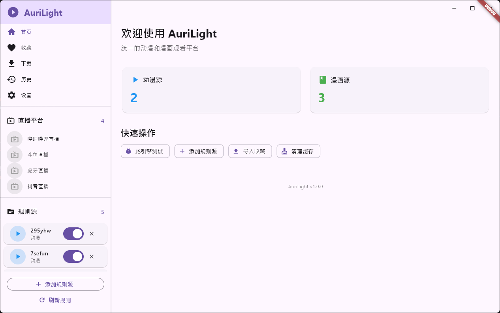
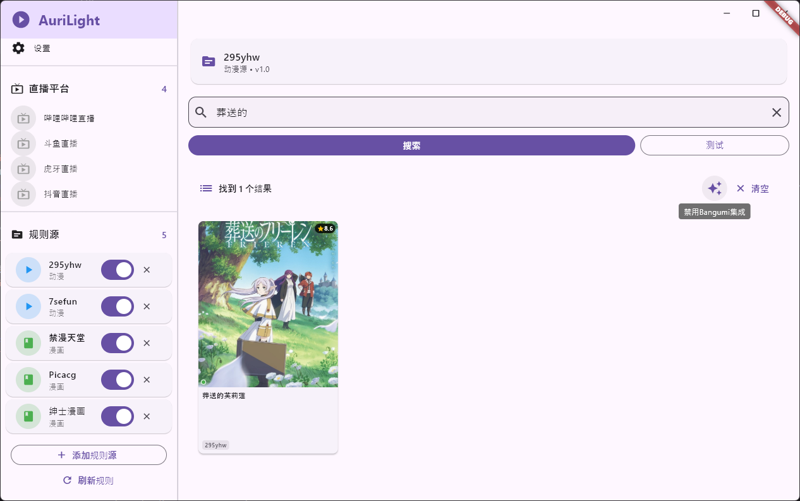
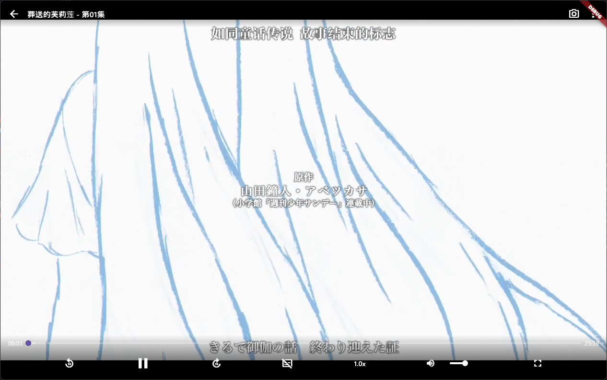
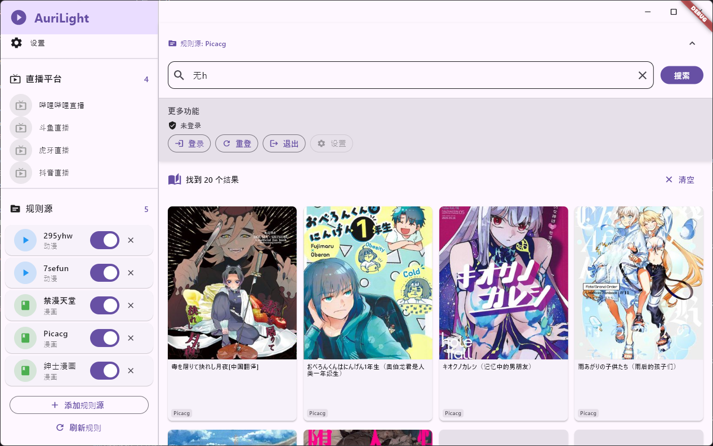
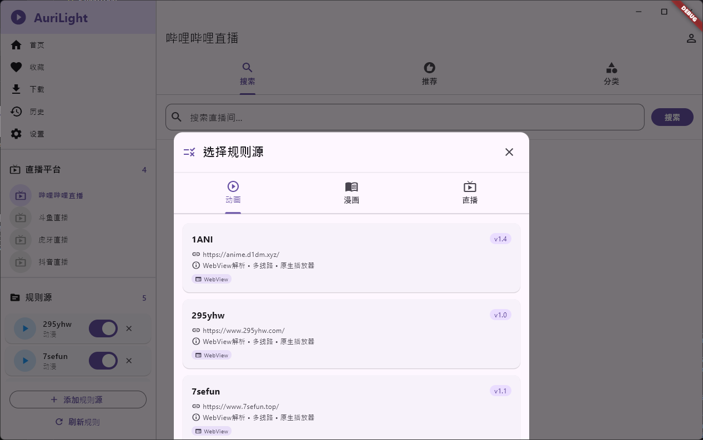
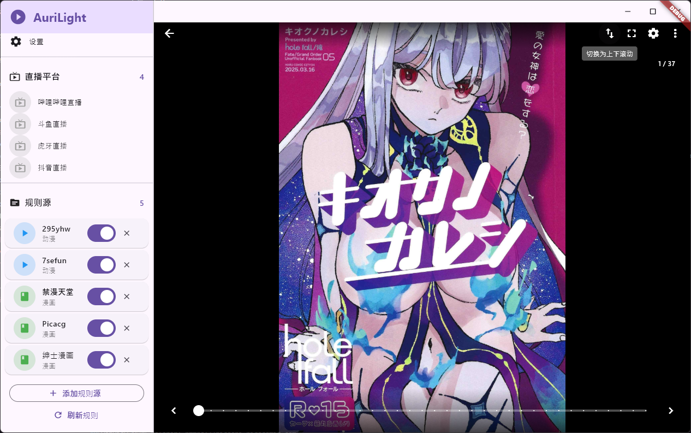

<p align="center">
  
</p>

<h1 align="center">AuriLight</h1>

<p align="center">
  <b>统一的动漫和漫画观看平台</b><br>
  融合 Kazumi 和 Venera 的优秀特性，打造纯净的观看体验
</p>

<p align="center">
  
  
  
</p>

---

## 📸 截图预览

<p align="center">
  
  
  
</p>
<p align="center">
  
  
  
</p>

---

## ✨ 功能特性

### 🎬 动漫模块
- 多源聚合搜索，支持 Kazumi JSON 规则
- 多线路播放，自动切换备用线路
- 完整的播放器控制（全屏、倍速、手势控制）
- 锁定控制、长按加速、截图功能

### 📚 漫画模块
- 支持 JSON 规则引擎
- JM 图片解密（自动还原打乱的图片）
- 双击缩放、左右翻页/上下滚动模式
- 键盘/滚轮翻页支持
- 图片预加载优化

### ⭐ 收藏系统
- 分类收藏管理（漫画、动漫、直播、小说）
- 点击收藏直接跳转详情页
- Hive 本地存储，数据持久化

### 📺 直播模块
- 支持多平台纯净直播观看
- 弹幕功能支持

### 🛠️ 其他功能
- 侧边栏规则源管理
- 缓存清理
- 桌面端全屏支持

---

## 🏗️ 技术架构

| 模块 | 技术 |
|------|------|
| 状态管理 | MobX |
| 本地存储 | Hive |
| 视频播放 | media_kit |
| 图片查看 | photo_view |
| 网络请求 | Dio + WebView 渐进式混合 |
| 桌面窗口 | window_manager |

---

## 📦 项目结构

```
lib/
├── core/                    # 核心服务
│   ├── models/             # 数据模型
│   ├── services/           # 业务服务
│   │   ├── manga_rule_manager.dart
│   │   ├── manga_image_provider.dart
│   │   ├── jm_image_decoder.dart
│   │   ├── favorite_service.dart
│   │   └── cache_service.dart
│   └── utils/              # 工具类
├── features/               # 功能模块
│   ├── home/              # 主页
│   ├── anime/             # 动漫
│   ├── manga/             # 漫画
│   ├── favorite/          # 收藏
│   └── live/              # 直播
└── main.dart              # 入口
```

---

## 🚀 快速开始

### 环境要求
- Flutter SDK >= 3.10.0
- Dart SDK >= 3.0.0

### 安装运行

```bash
# 克隆项目
git clone https://github.com/your-username/AuriLight.git
cd AuriLight

# 安装依赖
# 部分库使用了自制或他人制作的第三方库，整合后提供地址，目前暂无。
flutter pub get

# 生成代码
flutter pub run build_runner build --delete-conflicting-outputs

# 运行
flutter run
```

### 构建发布

```bash
# Windows
flutter build windows --release

# Android
flutter build apk --release
```

---

## 📋 开发计划

- [x] 动漫搜索和播放
- [x] 漫画搜索和阅读
- [x] JM 图片解密
- [x] 收藏系统
- [x] 播放器优化（全屏、鼠标手势、倍速）
- [x] 阅读器优化（双击缩放、滚动模式）
- [ ] 历史记录
- [ ] 下载管理
- [ ] 数据导入导出
- [ ] 更多规则源支持
- [ ] webdav用户记录云端保存
- [ ] 聚合形搜索
---

## 🙏 致谢

本项目参考了以下优秀开源项目：
- [Kazumi](https://github.com/Predidit/Kazumi) - 动漫规则系统
- [Venera](https://github.com/venera-app/venera) - 漫画规则系统和阅读器

---

## 📄 许可证

本项目基于 [MIT License](LICENSE) 开源。

---

<p align="center">
  <b>如果觉得有用，请给个 ⭐ Star 支持一下！</b>
</p>
